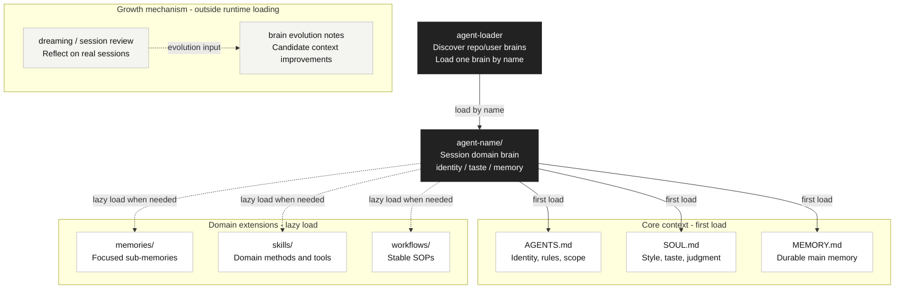

# Agent Brain Specification

## Why Agent Brain

A general-purpose agent starts every session from a blank context. Domain knowledge, working style, past judgments, and reusable processes are hard to retain consistently, so recurring domain tasks must be re-explained every time.

An agent brain is a long-lived context pack for a recurring domain. It puts an agent's identity, judgment criteria, style, main memory, domain methods, and stable SOPs into one loadable structure so the agent does not start from zero each time—it enters tasks with a defined brain.

It does not replace global Skills:

- `skill` is a reusable method or tool capability; it answers **how to do something**
- `workflow` is an end-to-end SOP for stable business behavior; it answers **what process to follow for this kind of work**
- `agent brain` is the overall context of identity, memory, and domain judgment; it answers **whose identity to work under, and on what history and standards**

Global Skills are meant for reuse across agents; `skills/` and `workflows/` inside a brain must be used in that brain's identity, style, and memory context.

## Agent Brain Structure



## Core Files

### AGENTS.md

Defines the agent's identity, working rules, responsibilities, and boundaries.

This is the primary definition file for how the agent works.

`AGENTS.md` must use YAML frontmatter and at minimum include:

```yaml
---
name: agent-name
description: One sentence describing this agent's purpose and when to use it.
---
```

`name` is used to index and load the agent.

`description` is used to list available agents when the user forgets the agent name.

### SOUL.md

Defines the agent's style, temperament, product taste, and way of thinking.

This file describes how the agent should present itself, judge problems, and express itself—beyond strict rules.

### MEMORY.md

Defines the agent's main memory.

This file holds core memory the agent must retain long-term and keep available across tasks.

### memories/

Stores sub-memory files.

Sub-memories can be organized by date or by topic.

### skills/

Stores the agent's skills.

Each skill represents a reusable method or tool capability that helps the agent do work in its domain.

### workflows/

Stores the agent's workflows.

A workflow is an SOP abstraction for **a fixed behavior under a recurring, stable business state**. It pins down the steps, decision points, outputs, and review rules for that behavior. When the user mentions a business behavior, the corresponding workflow should usually be fixed—the agent should load and execute it directly rather than improvising the process each time.

`WORKFLOW.md` must use YAML frontmatter and at minimum include:

```yaml
---
name: workflow-name
description: One sentence describing this workflow's purpose and when to use it.
---
```

## Loading Entry Point

Agent brains are currently loaded through the `agent-loader` skill.

The built-in `agent-loader` in this repository lives at:

```text
skills/agent-loader
```

To use it as a global skill, copy or link that directory into your agent client's global skills directory.

It is not an agent brain itself—it is the loading entry point for the agent brain system.

`agent-loader` supports three operations:

- List currently available agents
- Resolve a specified agent by name
- Load a specified agent by name

Discovery uses two scopes:

```text
REPO: $CWD/.agents/agents up to $REPO_ROOT/.agents/agents
USER: $HOME/.agents/agents
```

Repo scope is searched from the current working directory upward to the repository root. User scope is searched after repo scope. If the same agent name exists in multiple locations, the first discovered agent wins.

`AGENT_BRAINS_ROOT` and the loader script's `--root` option override repo/user discovery and use `custom` scope.

When listing or resolving agents, `agent-loader` reads only each agent's `AGENTS.md` frontmatter and shows:

- `name`
- `description`
- `scope`
- `path`

When loading an agent, `agent-loader` first resolves the agent path, then reads in order:

1. `path/AGENTS.md`
2. `path/SOUL.md`
3. `path/MEMORY.md`

By default, do not read all files under `memories/`.

By default, do not read all `skills/*/SKILL.md` files.

By default, do not read all `workflows/*/WORKFLOW.md` files.

Only read the corresponding file when the current task needs it, or when `AGENTS.md` / `MEMORY.md` explicitly points to a memory, skill, or workflow.

`agent-loader` only loads context; it does not create, update, or audit agent brains. Creation, updates, and auditing are handled by `agent-creator`.

## Growth

An agent brain should be able to grow over time.

### Memory

Long term, memory should be able to help update the following through periodic consolidation and a dreaming mechanism:

- `AGENTS.md`
- `MEMORY.md`
- `SOUL.md`
- `skills/`
- `memories/`
- `workflows/`

At the current stage, memory updates are done manually by the user.

When the user asks to review a real session or evolve an agent brain, `agent-creator` can use session content to identify:

- Reusable capabilities that should become skills
- End-to-end processes that should become workflows
- Agent definitions, main memory, sub-memories, skills, or workflows that should be updated
- Old workflows that should be updated, split, or removed with explicit user approval

These evolutions must be based on real session content or explicit user description—not invented from nothing.

### Skill and Workflow

Long term, agents may be able to create, update, and optimize skills and workflows. At the current stage, this must be done based on real session content or explicit user description—not invented from nothing.
